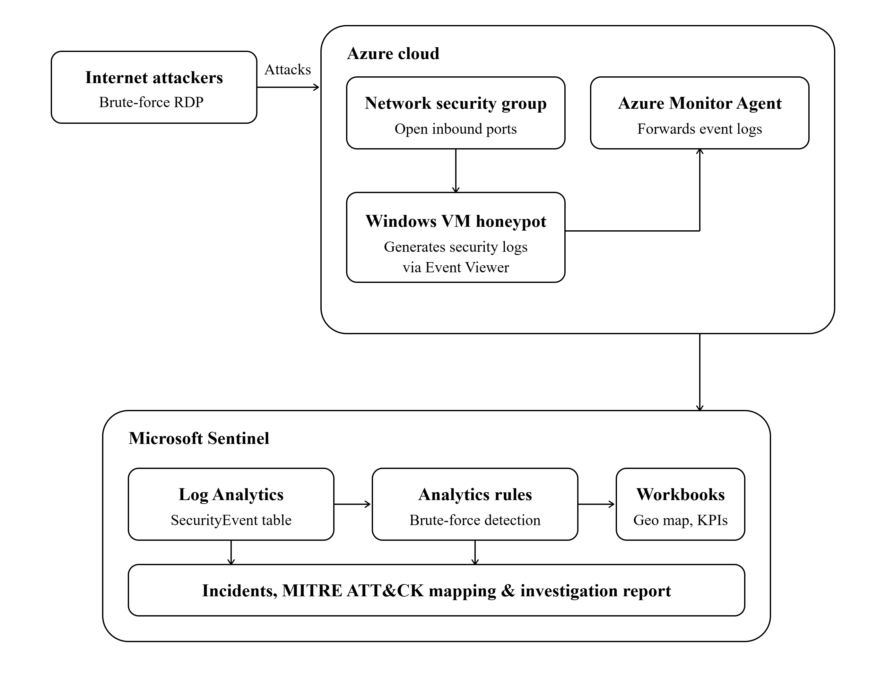

# Azure Honeypot SOC Lab: Detection, Monitoring, and Investigation

## Overview

This project demonstrates the deployment of an internet-facing Windows virtual machine in Microsoft Azure configured as a honeypot and monitored using Microsoft Sentinel.

The objective was to collect, analyze, and investigate real-world authentication attacks targeting an exposed system. Microsoft Sentinel was used to ingest Windows Security Events, enrich attacker IP addresses with geolocation data, visualize attack patterns, and investigate authentication activity.

## Project Objectives

- Deploy a publicly accessible Windows VM in Azure
- Collect Windows Security Events using Microsoft Sentinel
- Monitor brute-force authentication attempts
- Enrich attacker IP addresses using GeoIP data
- Build dashboards and visualizations using Sentinel Workbooks
- Investigate successful authentication events
- Create detection logic using KQL

---

## Architecture

```text
Internet
    │
    ▼
Azure Windows VM (Honeypot)
    │
    ▼
Windows Security Events
    │
    ▼
Log Analytics Workspace
    │
    ▼
Microsoft Sentinel
    │
    ├── Attack Map
    ├── Authentication Analysis
    ├── Investigation Dashboard
    └── Detection Queries
```


---

## Technologies Used

- Microsoft Azure
- Microsoft Sentinel
- Log Analytics Workspace
- Windows Event Logs
- Kusto Query Language (KQL)
- GeoIP Watchlist

---

## Data Sources

| Event ID | Description |
|-----------|-------------|
| 4625 | Failed Logon |
| 4624 | Successful Logon |
| 4688 | Process Creation |
| GeoIP Watchlist | IP Geolocation Enrichment |

---

# Workbook 1: Global Attack Overview

This dashboard provides a geographic overview of brute-force activity observed against the honeypot.

### Features

- Global attack map
- Geolocation enrichment
- Attack concentration visualization
- Attack source analysis

### Sample Visualization

> Insert attack map screenshot here.

### Example Query

```kql
let GeoIPDB_FULL = _GetWatchlist("geoip");
SecurityEvent
| where EventID == 4625
| where IpAddress != "-"
| evaluate ipv4_lookup(GeoIPDB_FULL, IpAddress, network)
| summarize FailureCount=count()
    by IpAddress, latitude, longitude, cityname, countryname
```

---

# Workbook 2: Authentication Analysis

This dashboard focuses on authentication attack patterns.

### Features

- Top attacking IP addresses
- Attack volume over time
- Most targeted usernames
- Authentication trend analysis

### Visualizations

#### Top Attacker IPs

> Insert screenshot here.

#### Attack Timeline

> Insert screenshot here.

#### Most Targeted Usernames

> Insert screenshot here.

### Findings

Commonly targeted usernames included:

- administrator
- admin
- guest
- test

These patterns are consistent with automated credential guessing attacks.

---

# Workbook 3: Incident Investigation

This dashboard was used to investigate successful authentication events and determine whether unauthorized access occurred.

### Investigation Areas

- Successful logon events (4624)
- Logon type analysis
- Process creation events
- Authentication correlation

### Successful Logon Analysis

Successful authentication events were investigated to determine whether any external attacker successfully accessed the system.

Investigation determined that all successful logons were attributable to legitimate administrative activity performed during deployment, testing, and maintenance of the VM.

No evidence of successful unauthorized external access was identified during the monitoring period.

### Logon Type Distribution

Observed logon types included:

| Logon Type | Description |
|------------|-------------|
| 0 | System |
| 2 | Interactive |
| 3 | Network |
| 5 | Service |
| 7 | Unlock |

No successful RDP logons (Logon Type 10) originating from external attackers were observed.

### Process Creation Analysis

Process creation events were reviewed to identify potential post-authentication activity.

Observed processes included:

- smss.exe
- csrss.exe
- wininit.exe
- winlogon.exe
- services.exe
- lsass.exe
- autochk.exe

These were determined to be normal Windows operating system processes associated with system startup and authentication.

No suspicious command execution or attacker tooling was identified.

---

# Detection Queries

## Brute Force Detection

Detects excessive failed authentication attempts from a single source.

```kql
SecurityEvent
| where EventID == 4625
| summarize FailureCount=count()
    by IpAddress, bin(TimeGenerated, 10m)
| where FailureCount >= 20
```

---

## Top Attacking IP Addresses

```kql
SecurityEvent
| where EventID == 4625
| summarize FailedAttempts=count()
    by IpAddress
| top 15 by FailedAttempts desc
```

---

## Authentication Trend Analysis

```kql
SecurityEvent
| where EventID == 4625
| summarize FailedAttempts=count()
    by bin(TimeGenerated, 1h)
```

---

# MITRE ATT&CK Mapping

| Observed Activity | ATT&CK Technique |
|------------------|------------------|
| Brute Force Attempts | T1110 |
| Remote Service Targeting (RDP) | T1021 |
| Authentication Monitoring | T1078 (Investigated) |

---

# Key Findings

- Thousands of brute-force authentication attempts were observed.
- Attack traffic originated from multiple geographic regions.
- Automated credential guessing targeted common administrative accounts.
- Successful authentication events were investigated and validated.
- No successful external compromise was observed during the monitoring period.
- Windows process activity was reviewed and determined to be normal system behavior.

---

# Lessons Learned

- Internet-exposed systems receive automated attack traffic rapidly.
- Failed authentication events provide valuable threat intelligence.
- Successful logon events require investigation and validation before being treated as incidents.
- Microsoft Sentinel provides effective capabilities for monitoring, enrichment, investigation, and visualization using KQL.

---

# Analyst Conclusion

This project demonstrated the deployment and monitoring of an internet-facing Azure honeypot using Microsoft Sentinel.

While a significant volume of brute-force authentication attempts was observed, investigation revealed no evidence of successful unauthorized access during the monitoring period. All successful authentication events were attributed to legitimate administrative activity.

The project highlights the importance of validating alerts and authentication events through investigation rather than assuming compromise based solely on attack volume.
